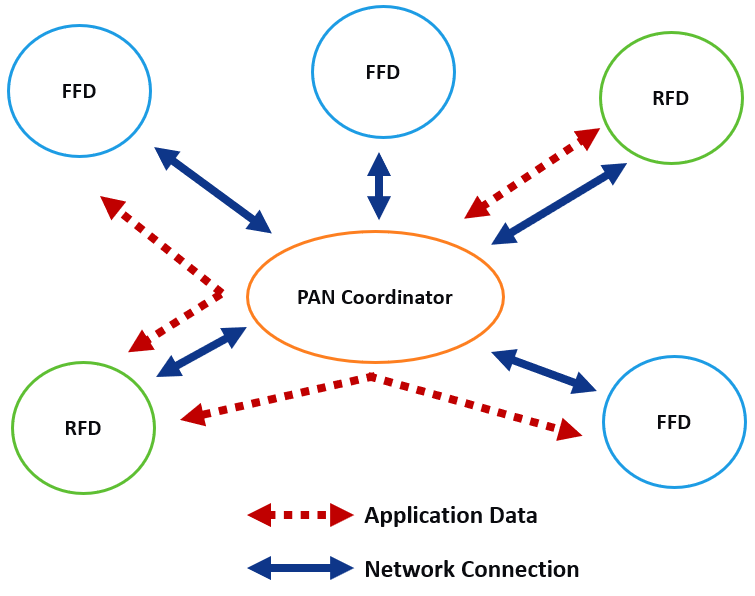
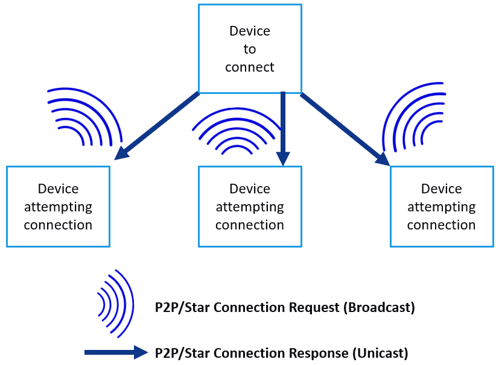
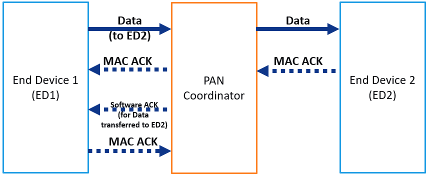

# Learning Phase
> "Wireless Made Easy!" - Enable Easy to use Star Protocol for Long-Range & Low Power Applications on SAM R34 LoRa Technology ICs and WLR089U0 Module

[Back to Main page](../README.md#top)

## A la carte

1. [Introduction](#step1)
1. [Protocol Overview](#step2)
1. [Unique Features](#step3)
1. [Custom MAC Commands for LoRa Star Wireless Protocol](#step4)
1. [Handshaking in LoRa Star Wireless Protocol](#step5)
   1. [LoRa Star Routing](#step5a)
   1. [LoRa Star Data Transfer](#step5b)
1. [Additional Documentation](#step6)
1. [Limitations](#step7)

## Introduction

The demand is growing for more and more applications to move to wireless communication.

The benefits are reduced costs and ease of implementation. Wireless communication does not require cabling and other hardware, and the associated installation costs. It also can be implemented in locations where cabling would be hard, if not impossible, to install.

MiWi stack applies to low data rate applications with low-power and low-cost requirements. With the advantage of long range transceiver support provided by the LoRa transceivers, we are combining the advantage of both the MiWi stack and Long range support by this LoRa Star protocol.

<b>
The Microchip LoRa Star Wireless Protocol is a variation of MiWi Stack, using exclusively Microchip SAM R34 LoRa Technology ICs and WLR089U0 Module. The LoRa Star Wireless Protocol is not compatible with the others MiWi Stacks.

</b>

The protocol provides reliable direct wireless communication via an easy-to-use programming interface. It has a rich feature set that can be compiled in and out of the stack to meet a wide range of application needs – while minimizing the stack footprint.

This guide describes the Microchip Wireless LoRa Star Protocol and usage of the LoRa transceiver modulation and channel support. The present documentation details the supported features and how to implement them. Simple, application-level data structures and programming interfaces also are described.

This assumes that readers know C programming. It is strongly recommended that readers review the LoRa Transceiver operations before starting this application note or working with the LoRa Star wireless protocol.

This guide provides all the information needed for a developer to understand the LoRa Star applications implemented on Microchip LoRa Star Protocol available in SAM R34 family composed of SAM R34 ICs and WLR089U0 Module.

## Protocol Overview

The LoRa Star protocol is an extension of the [LoRa P2P protocol](https://github.com/MicrochipTech/atsamr34_long_range_p2p/) which is based on the MiWi Protocol.

From a device role perspective, the topology has one PAN Coordinator that initiates communications and accepts connections from other devices.

It can have several end devices that join the communication. End devices can establish connections only with the PAN Coordinator. As to functionality type, the Star topology’s PAN Coordinator is a Full Function Device (FFD). An end device can be an FFD with its radios ON all the time, or an Reduced Function Device (RFD) with its radio OFF when idle. Regardless of its functional type, the end devices can only communicate to the PAN Coordinator.

As shown in the below figure, the application data can be sent to any device in the network, as the PAN Coordinator forwards data from one end device to another.

## Unique Features

The Star topology supported by the LoRa P2P Protocol stack provides all the features supported by the peer-to-peer topology. However, Star topology supports several more features based on the device roles.

PAN Coordinator supports the following features:

- Shares peer device connection (FFDs and RFDs) information to all the peer devices
- Forwards data packet from one end device to another end device
- Checks network health periodically (optional)
- Transmits data packet to end devices
- Handles Indirect Messages for sleeping end devices (RFDs)
- Supports software ACK to indicate successful data transmission

The FFD (end devices) or RFDs (sleeping end devices) support the following features:
- Link status
- Leave Network command

## Custom MAC Commands for LoRa Star Wireless Protocol

The LoRa Star protocol extends the functionality of the IEEE 802.15.4 specification by using custom MAC commands for removing the connection between two devices. 

The following table lists all the custom MAC commands of the protocol.

| Command Identifier | Command Name | Description |
| ------------------ | ------------ | ----------- |
| 0xCC | Forward Packet CMD with Payload | 0xCC (1 byte) Command. Destination end device address (3 bytes). Data payload. |
| 0xDA | Software ACK to END Devices | N/A |
| 0x7A | LINK STATUS | N/A |
| 0x77 | Connection Table Broadcast Command | 0x77 (1 byte) Command. Total number of end-devices in the network. |

The following table shows the modified connection mode details in the star protocol.

| Node Capacity | Sleep | Reserved | Security Enabled | Connection Mode | Reserved |
| ------------- | ----- | -------- | ---------------- | --------------- | -------- |
| Bit | 0 | 1-2 | 3 | 4-5 | 6-7 |

Connection mode details:

| Value | Connection Mode |
| ----- | --------------- |
| 00 | Enable All Connections |
| 01 | Enable Previous Connections |
| 10 | Enable Active Scan Response |
| 11 | Disable All Connections |

## Handshaking in LoRa Star Wireless Protocol

### LoRa Star Routing

The following figure shows that a LoRa Star network consists of two types of devices (PAN Coordinator and end devices - FFDs or RFDs). 

The PAN Coordinator creates the network while the end devices join the PAN Coordinator.

The PAN Coordinator can send messages to all the end devices in the network in a single hop. 

If an end device wants to communicate to another end device which may or may not be in the vicinity, the source end device must first send the packet to the PAN Coordinator and then the PAN Coordinator forwards that packet to the destination end device (2 hops).

In a LoRa Star network, it is the responsibility of the PAN Coordinator to share the peer connections (end device addresses). In this way, all the end devices in the network know about the existence of every other device in network

When an end device wants to send a message to another end device, the source end device includes the address of the destination end device in the data payload. 

The source end device payload comprises of the type of packet (0xCC), destination end device address (only first 3 bytes) and the data payload. 

When this packet is received by the PAN Coordinator, it indicates that this packet is intended for another end device, hence, it forwards the packet to the destination end device.

### LoRa Star Data Transfer

The connection requests and responses are similar to that of P2P between the nodes. However, in LoRa Star, the PAN Coordinator forms the network, connects the end devices and also supports the end devices to communicate between each devices (via PAN Coordinator). 

The following figure shows a simple data transfer between the end devices in the Star network.

## Additional Documentation

Checkout the [LoRa P2P](https://github.com/MicrochipTech/atsamr34_long_range_p2p/blob/master/01_learning_phase/README.md#top) for common documentation related to: Network Freezer, Sleep mode, MiApp APIs, etc.

## Limitations

The list of known limitations are described below:

1. Data Length limitation based on the Data Rate and SF and not implemented.
2. LoRaWAN functions are retained in Library.
3. Null packet transmitted from the FFD device to RFD if no data available for the RFD.

<a href="#top">Back to top</a>

