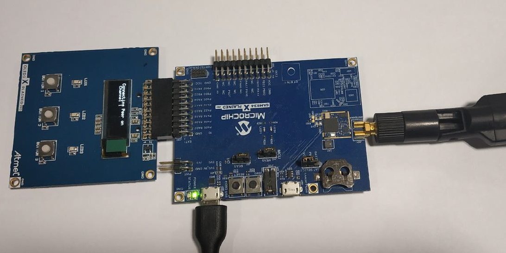
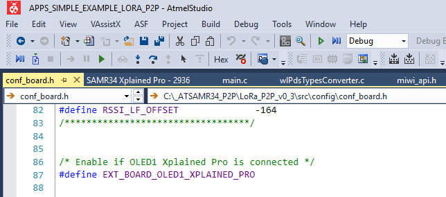

# Getting Started
> "Wireless Made Easy!" - Enable Easy to use Star Protocol for Long-Range & Low Power Applications on SAM R34 LoRa Technology ICs and WLR089U0 Module

[Back to Main page](../README.md)

## A la carte

1. [Introduction](#step1)
1. [Overview](#step2)
1. [Supported Hardware Platforms and IDEs](#step3)
1. [Development Environment Setup](#step4)
   1. [Microchip Studio Installation](#step4a)
   1. [Stack Configurations](#step4b)
   1. [Building Applications in Microchip Studio](#step4c)
1. [Hardware Environment Setup](#step5)
1. [Out-of-box Demo Application](#step6)

## Introduction<a name="step1"></a>

This document describes prototyping, implementing, testing, and deploying wireless sensor networks using LoRa Star Protocol based on the Microchip software platform. This document also details how to get started with the LoRa Star by installing the development environment, setting up hardware, and programming devices with the reference application.

## Overview<a name="step2"></a>

LoRa Star Development Environment was developed by Microchip to support a wide range of wireless applications. LoRa Star Development Environment is based on the MiWi stack as defined by three blocks:

- Application layers (User App + MiApp)
- Protocol layers (MiWi Star + MiMAC)
- RF transceiver layer (MiPhy SAMR34)

The three blocks are linked together by MAC and App interfaces. The Application layer uses App interfaces to communicate to the protocol layer. In the protocol layer, the LoRa Star is implemented.

> Notice the MiPhy layer relies on the Transceiver Abstraction Layer (TAL) which come pre-compiled as part of the LoRaWAN stack library.

## Supported Hardware Platforms and IDEs<a name="step3"></a>

The following table lists the supported hardware platforms and IDEs for the LoRa Star protocol.

| Device       | RF Transceiver | Supported Evaluation Kit | Supported IDEs   |
| ------------ | -------------- | ------------------------ | ---------------- |
| SAMR34J18B   | SX1276 (in SIP)| SAMR34 Xplained Pro      | Microchip Studio v7.0|
| WLR089U0     | SX1276 (in SIP)| WLR089 Xplained Pro      | Microchip Studio v7.0|

## Development Environment Setup<a name="step4"></a>

This chapter provides instructions on how to set up the LoRa Star software package and supported IDEs. It also describes the structure of the MiWi package, and includes references to hardware setup of the supported platforms.

### Microchip Studio Installation<a name="step4a"></a>

Microchip Studio can be used to develop and debug applications for AVR- and ARM-based platforms. Microchip Studio is equipped with the GCC compiler and does not require any additional external tools to compile and debug LoRa Star application.

Perform the following steps to install the Microchip Studio.
1. [Download](https://www.microchip.com/mplab/microchip-studio) and install the latest Microchip Studio version, if not already installed on your PC.
2. Add path to the folder containing the ARM GCC compiler to the Path Windows environment variable. The compiler is located in the `\Atmel\Studio\7.0\toolchain\arm\arm-gnu- toolchain\arm-none-eabi\bin` directory of the Microchip Studio installation directory.\
This step is necessary for command line compilation (with makefiles).
3. Install latest ASFv3 as an extension to Microchip Studio from: **Tools -> Extensions and updates**
4. Install the Device Part Pack for developing with SAMR34/R35 or WLR089U0 from: **Tools -> Device Pack Manager -> Search for** SAMR34 and/or WLR089 and click install
5. Restart Microchip Studio 7.0 IDE

### Stack Configurations<a name="step4b"></a>

LoRa Star uses the configuration files to regulate the behavior of the stack.

The following are the locations of header files to configure the behavior of Star application:

```
- config\miwi_config.h
- config\miwi_config_p2p.h
```

Default channel (ch 1: `FREQ_863000KHZ`) is configured in the file `task.c` through the variable `myChannel`.

Refer the function `phySetChannel()` implemented in `phy.c` for further details on the frequency map for LoRa Star application.

Default data rate setting is 5 (equivalent to Spreading Factor SF7), default bandwidth is 125 kHz and both parameters can be changed using the API `PHY_SetAttribute` implemented in `phy.c`.

By default, PA_Boost is disabled and Transmit Output Power is set to +1dBm. The API `PHY_SetTxPower` can be used to set the Tx power and the PA_Boost will be set accordingly.

### Building Applications in Microchip Studio<a name="step4c"></a>

Microchip Studio can be used to develop and build LoRa Star application. Reference applications include Microchip Studio project files located in the `\as5_arm` subdirectory of the application root directory. These projects depend on the configurations provided by the external low-level makefiles.

Perform the following steps to open a project:
- Open Microchip Studio
- Choose **File -> Open -> Project**
- Select **APPS_SIMPLE_EXAMPLE_LORA_STAR** Application project

Perform the following steps to build the application:
- From the main menu, choose **Build -> Rebuild All**

When the build process is complete, some of the `.hex, .srec, .bin and .elf` image files are generated based on the selected platform configuration.\
Use the `.hex` file for programming the devices via EDBG. The `.elf` is used for debugging.

> It is also possible to compile the applicationby running the make utility command to build the application from **Tools -> Command Prompt**\
`make clean all`

## Hardware Environment Setup<a name="step5"></a>

The following boards can be used in LoRa Star release:
- [SAM R34 Xplained Pro](https://www.microchip.com/DevelopmentTools/ProductDetails/dm320111)
- [WLR089U0 Module Xplained Pro](https://www.microchip.com/en-us/development-tool/EV23M25A) for more details

[OLED1 Xplained Pro Extension Board](https://www.microchip.com/developmenttools/ProductDetails/atoled1-xpro) can be used as an additional board to show the full-featured demo.\
This board must be connected on EXT1 connector of SAMR34/SAMR34 Module XPROs.\
Check out the [OLED1 Xplained Pro User Guide](https://www.microchip.com/developmenttools/ProductDetails/atoled1-xpro) for more details.

Simply connect the micro USB cable to the **Debug EDBG USB** port of the board and connect the other end to the computer.

<p align="center">

</p>

Download and install a serial terminal program like [TeraTerm](https://osdn.net/projects/ttssh2/releases/). Launch TeraTerm program and configure the serial ports mounted with: 115200 bps, 8 N 1

## Out-of-box Demo Application<a name="step6"></a>

The simple example application code focuses on the simplicity of the LoRa Star protocol stack application programming interfaces. It provides wireless communication between two devices with less than 30 lines of C code to run the stack in the application layer for both devices. In this application, the following features of LoRa Star protocol stack are demonstrated:
- Establish a connection automatically between PAN coordinator and end device
- Broadcast a packet
- Unicast a packet from one end device to another end device through PAN coordinator
- Apply security to the transmitted packet

By default, the Network Freezer is enabled in the application. The Network Freezer feature is used to store critical network information into the nonvolatile memory. 

To run full-featured Simple_Example_LoRa_Star application, the user needs to connect OLED1 Xplained Pro to the main board (SAMR34 or WLR089U0 Module Xpro). When using OLED1 Xplained PRO along with SAMR34 XPRO or WLR089U0 XPRO, the user needs to enable the macro `#define EXT_BOARD_OLED1_XPLAINED_PRO` in file `conf_board.h`.
<p align="center">

</p>

To run the simple example application, perform the following instructions.

1. Program node 1, node 2 and node 3 with Simple_Example_LoRa_Star application firmware.
2. Power the nodes one by one.
3. Power only the node 1
4. Wait for few seconds, until the orange LED is ON. A network has been established by the PAN Coordinator.

> For the details of connection establishment, refer to section [Handshaking in LoRa Star Wireless Protocol](../01_learning_phase/README.md#step5).

If the demo is running with the **ATOLED1-XPRO** attached to the board, critical information is shown on the LCD of the demo board. It first shows the demo name, RF transceiver and node number, then connecting information and channel information is shown before the LCD shows the demo instruction.

| Text on OLED Display           | Description                               |
| ------------------------------ | ----------------------------------------- | 
| Simple STAR on SAMR34 Node | Splash screen after powering ON the board |
| SW: Use Nwk Freezer | Network freezer is enabled |
| Connecting Peer on Channel 1   | Connecting to a network if found          |
| Connected Peer on Channel 1    | Connected to a network. This log does not show for the first device since it starts the network when it is unable to find network to join |
| PC :SW0 to broadcast | Demo instruction is displayed |

If a serial console is opened to monitor application output, the user can observe the device information printed out from the nodes.

The PAN Coordinator Node is starting network:

```
-----------------------------------------------------
-----------------------------------------------------
Starting Node 1 of Simple Demo for LoRa Star Stack ...
Full Function Device (FFD) operations
     RF Transceiver: SX_1276
     Demo Instruction:
                     Power on the board until LED 1 lights up
                     to indicate connecting with peer.
                     Push Button 1 to broadcast message.
                     LED 1 will be toggled upon receiving messages.

Periodic Transmission = Disable
Duty Cycling support = Disable
LBT support = Disable

-----------------------------------------------------
RF Parameters
 - Tx output power: 1
 - PA boost: 0
 - Spreading factor: SF7
 - Bandwidth (125kHz=7, 250kHz=8, 500kHz=9): 7
-----------------------------------------------------

Connecting Peer on Channel 1

Connect Operation Status: 0

Started Wireless Communication on Channel 1


My Address: 0x000425191801e4e9  PANID: 0x1234  Channel: 1

Connection     PeerLongAddress     PeerInfo     RxOnStatus

Save Connection

```

> Note: For every 15 seconds, PAN Coordinator broadcasts the connection table to all the end nodes and, the end nodes send the link status back to PAN Coordinator. After the PAN coordinator has established a network, power on a second node and follow the instructions in Step 5 to join the PAN Coordinator. This process may be repeated to add any number of Nodes to the network.

5. Power ON another node. It will act as an end device.

| Text on OLED Display           | Description                               |
| ------------------------------ | ----------------------------------------- | 
| Simple STAR on SAMR34 Node | Splash screen after powering ON the board |
| SW: Use Nwk Freezer | Network freezer is enabled |
| Connecting Peer on Channel 1   | Connecting to a network if found          |
| Connected Peer on Channel 1    | Connected to a network. |
| SW0: Unicast<br /> BUTTON1: Next Node | Demo instruction is displayed |

If a serial console is used on the end device node, the user can observe the device has joined the network formed by the Pan Coordinator.

```
-----------------------------------------------------
-----------------------------------------------------
Starting Node 1 of Simple Demo for LoRa Star Stack ...
Full Function Device (FFD) operations
     RF Transceiver: SX_1276
     Demo Instruction:
                     Power on the board until LED 1 lights up
                     to indicate connecting with peer.
                     Push Button 1 to broadcast message.
                     LED 1 will be toggled upon receiving messages.

Periodic Transmission = Disable
Duty Cycling support = Disable
LBT support = Disable

PANID:1234 Channel:1
-----------------------------------------------------
RF Parameters
 - Tx output power: 1
 - PA boost: 0
 - Spreading factor: SF7
 - Bandwidth (125kHz=7, 250kHz=8, 500kHz=9): 7
-----------------------------------------------------

Connecting Peer on Channel 1

Connect Operation Status: 6

Connected Peer on Channel 1


My Address: 0x000425191801e248  PANID: 0x1234  Channel: 1

Connection     PeerLongAddress     PeerInfo     RxOnStatus
00             000425191801e4e9    09           00


My Address: 0x000425191801e248
------------------------------------------------
            Connection table
------------------------------------------------

ID      Device Address          status  PAN ID
01      000425191801e4e9        1       00

------------------------------------------------

Save Connection

```

> Note: The Pan Coordinator prints the updated Connection Table to the console.

```
My Address: 0x000425191801e4e9
------------------------------------------------
            Connection table
------------------------------------------------

ID      Device Address          status  PAN ID
01      000425191801e248        1       00

------------------------------------------------
```

After getting connected to PAN Coordinator, the LCD displays options to unicast a message to either the PAN Coordinator or to another node in the network.

| Text on OLED Display           | Description                               |
| ------------------------------ | ----------------------------------------- | 
| SW0: Unicast<br /> BUTTON1: Next Node | Pressing BUTTON1 displays the next node to choose |
| SW0:00-48e201-me<br >> BUTTON1: Change node | Pressing SW0 button sends unicast to the selected device |

6. Press BUTTON1 to display the address of the next node in the unicast address selection list

> The LCD screen displays the index of the device, the three bytes of the short address followed by "me" keyword indicating the message will have the Pan Coordinator as destination.<br /> e.g: 00-48e201-me:</br> - 00: device index 0</br> - 48e201: short address of the device</br> - (me): message will be addressed to the Pan Coordinator

7. Press SW0 button at the end node, a unicast message is sent to:
* the PAN Coordinator is indicated as: "xx-xxxxxx-me"
* the destination end device is indicated as: "xx-xxxxxx"

On the serial console, observe the printout of the unicast packet source address, signal strength and the packet payload.

```
Unicast Packet with RSSI de from 042519181e248: UUUUUUUUUUUUUUUUUUUUUUUUUUUUUUUUUUUUUUUUUUUUUUUUUUUUUUUUUUUUUUUUUUUUUUUUUUUUUUUUUUUUUUUUUUUUUUUUUUUUUUUUUUUUUUUUUUUUUUUUUUUUUUUUUUUUUUUUUUUUUUUUUUUUUUUUUUUUUUUUUUUUUUUUUUUUUUUUUUUUUUUUUUUUUUUUUUUUUUUUUUUUUUUUUUUUUUUUUU
```

After a successful transmission, the TX value is incremented at the source end node. The RX value is incremented at the destination node (here the PAN Coordinator) and three bytes of source MAC addresses are displayed.

| Text on OLED Display           | Description                               |
| ------------------------------ | ----------------------------------------- | 
| TX Message: 0</br>RX Messages: 1 | In the nodes, LCD displays the number of transmitted and received messages |
| Data Packet from Address: 48e201 | After one second, the LCD display shows this message |


8. Press SW0 button at Pan Coordinator to broadcast message to all the end nodes in the network.

> Note: When the destination node receives the message from source (end nodes or Pan Coordinator), the RX value is incremented. 

On the serial console, observe the printout of the broadcast packet source address, signal strength and the packet payload.

```
Broadcast Packet with RSSI e2 from 042519181e4e9: BBBBBBBBBBBBBBBBBBBBBBBBBBBBBBBBBBBBBBBBBBBBBBBBBBBBBBBBBBBBBBBBBBBBBBBBBBBBBBBBBBBBBBBBBBBBBBBBBBBBBBBBBBBBBBBBBBBBBBBBBBBBBBBBBBBBBBBBBBBBBBBBBBBBBBBBBBBBBBBBBBBBBBBBBBBBBBBBBBBBBBBBBBBBBBBBBBBBBBBBBBBBBBBBBBBBBBBBBB
```

9. When the device reboots or power is rebooted, it tries to restore the existing data from the nonvolatile memory and continues to operate in the same network with existing network information.

> The Network Freezer is enabled by default in the application using by including `ENABLE_NETWORK_FREEZER` symbol in **Project Properties -> Toolchain -> ARM/GNU C Compiler -> Symbol**.

After a reboot, perform the following steps using the Network Freezer to restore the existing data in the node:

- After Step 4., the LCD displays the message: SW: Use Nwk Freezer in 5 sec.</br>
Press the SW buttonwithin 5 seconds to boot the application from stored network parameters, or the user can press and hold the SW button immediately after the power reboot till the LCD displays the following message.

| Text on OLED Display           | 
| ------------------------------ | 
| SW: Use Nwk Freezer</br> Press in 5 sec  |

- If the SW button is pressed within the timeout, the application restores the data from the Network Freezer and the LCD displays the following message.

| Text on OLED Display           | 
| ------------------------------ | 
| Restoring Network !!  |

10. Data communication can be either secured or non-secured in the entire network. The security feature can be enabled by defining the MACRO `#define ENABLE_SECURITY` in the file `miwi_config.h`

11. The unicast direct data communication can be acknowledged communication which has the automatic retry for the failed communication. The acknowledgment timeout and the number of times the failed data shall be retried can be configured using the below defines available in `miwi_config.h`
```
#define ACK_TIMEOUT_INTERVAL 1
#define DATA_RETRY_ATTEMPT 3
```

12. To enable the sleep functionality on one of the device and become an RFD, need to include the `ENABLE_SLEEP_FEATURE` symbol in **Project Properties -> Toolchain -> ARM/GNU C Compiler -> Symbol**


<a href="#top">Back to top</a>

