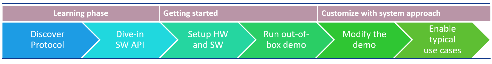

# ATSAMR34_LONG_RANGE_STAR

> "Wireless Made Easy!" - Enable Easy to use Star Protocol for Long-Range & Low Power Applications on SAM R34 LoRa Technology ICs and WLR089U0 Module

Devices: | **ATSAMR34 | WLR089U0**

## ⚠ Disclaimer

<b>
THE SOFTWARE ARE PROVIDED "AS IS" AND GIVE A PATH FOR SELF-SUPPORT AND SELF-MAINTENANCE.  
This repository contains unsupported example code intended to help accelerate client product development. It is not validated for production nor audited for security best-practices.  
Note that while this repository is unsupported, Microchip welcome community contributions, and all pull-requests will be considered for inclusion into the repository.

</b>

> Interact with peers in the community at [LoRa Forum](https://www.microchip.com/forums/f512.aspx).

## Abstract

Start from navigating in the resources available then take a deep breath and dive-in the details of the LoRa Star Protocol and the APIs available exclusively for SAM R34 LoRa Technology ICs and WLR089U0 Module. Get at least 3 evaluation boards, setup your software environment and enjoy the Out-of-box demo capable of establishing a wireless communication between two devices with less than 30 lines of C code to run the stack in the application layer. Then customize the reference sample code and enable application to fulfill typical real-life use case examples.

## Resources

- [SAMR34/35 and WLR089U Landing page](https://www.microchip.com/design-centers/wireless-connectivity/low-power-wide-area-networks/lora-technology/sam-r34-r35)
- [SAMR34 Device page](https://www.microchip.com/wwwproducts/en/ATSAMR34J18)
- [SAMR34 Xplained Pro Evaluation Kit](https://www.microchip.com/DevelopmentTools/ProductDetails/dm320111)
- [WLR089U0 Module page](https://www.microchip.com/wwwproducts/en/WLR089U0)
- [WLR089U0 Module Xplained Pro Evaluation Kit](https://www.microchip.com/EV23M25A)
- [Microchip Studio 7.0 IDE](https://www.microchip.com/mplab/microchip-studio)

## Sample Applications

[Clone/Download](https://docs.github.com/en/free-pro-team@latest/github/creating-cloning-and-archiving-repositories/cloning-a-repository) the current repo to get the software.

## A la carte

1. [Learning Phase](01_learning_phase/README.md#top)
   1. [Introduction](01_learning_phase/README.md#step1)
   1. [Protocol Overview](01_learning_phase/README.md#step2)
   1. [Unique Features](01_learning_phase/README.md#step3)
   1. [Custom MAC Commands for LoRa Star Wireless Protocol](01_learning_phase/README.md#step4)
   1. [Handshaking in LoRa Star Wireless Protocol](01_learning_phase/README.md#step5)
      1. [LoRa Star Routing](01_learning_phase/README.md#step5a)
      1. [LoRa Star Data Transfer](01_learning_phase/README.md#step5b)
   1. [Additional Documentation](01_learning_phase/README.md#step6)
   1. [Limitations](01_learning_phase/README.md#step7)

1. [Getting Started](02_getting_started/README.md#top)
   1. [Introduction](02_getting_started/README.md#step1)
   1. [Overview](02_getting_started/README.md#step2)
   1. [Supported Hardware Platforms and IDEs](02_getting_started/README.md#step3)
   1. [Development Environment Setup](02_getting_started/README.md#step4)
      1. [Atmel Studio Installation](02_getting_started/README.md#step4a)
      1. [Stack Configurations](02_getting_started/README.md#step4b)
      1. [Building Applications in Atmel Studio](02_getting_started/README.md#step4c)
   1. [Hardware Environment Setup](02_getting_started/README.md#step5)
   1. [Out-of-box Demo Application](02_getting_started/README.md#step6)

1. <a href="https://github.com/MicrochipTech/atsamr34_long_range_p2p/blob/master/03_customize/README.md#top" target="_blank">Customize with system approach</a>

<!-- 1. [Customize with system approach](https://github.com/MicrochipTech/atsamr34_long_range_p2p/blob/master/03_customize/README.md#top) -->

